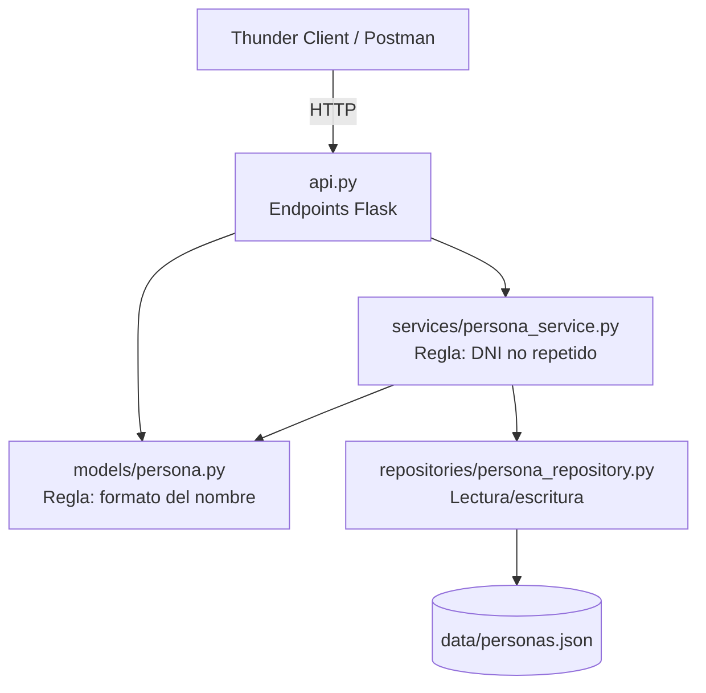

# TP Clase 17 - CRUD de Personas con Flask

API REST en Python + Flask para gestionar Personas (DNI y nombre), aplicando la arquitectura en capas vista en clase: **modelo**, **repositorio** y **servicio**, más la API como capa de entrada.

Alcance pedido: solo **GET** (todos y uno) y **POST**. No incluye PUT, DELETE ni capa de presentación.

## Estructura del proyecto



```
tp-clase17-personas/
├── api.py                         # Endpoints Flask (app factory, sin globales)
├── models/
│   ├── __init__.py
│   └── persona.py                 # Clase Persona + validaciones propias del objeto
├── repositories/
│   ├── __init__.py
│   └── persona_repository.py      # Persistencia en archivo JSON
├── services/
│   ├── __init__.py
│   └── persona_service.py         # Reglas que necesitan el repositorio
├── data/
│   └── personas.json              # "Base de datos"
├── requirements.txt
└── README.md
```

## Reglas de negocio y dónde viven

| Regla | Capa | Por qué |
|---|---|---|
| El nombre empieza con mayúscula, el resto en minúscula, solo letras, máximo 30 caracteres | Modelo (`Persona`) | Depende solo del propio objeto |
| El DNI es un entero positivo | Modelo (`Persona`) | Depende solo del propio objeto |
| El DNI no se puede repetir | Servicio (`PersonaService`) | Necesita consultar el repositorio, y el modelo nunca accede al repositorio |

## Cómo trabajo en este proyecto

- **Sin variables globales**: la app se crea con `create_app()` y cada endpoint instancia su propio `PersonaService`.
- Como el repositorio se crea en cada request, **persiste en `data/personas.json`** en lugar de en memoria; así los datos (y la validación de DNI duplicado) se mantienen entre requests.
- Los errores del modelo devuelven **400 Bad Request** y el DNI duplicado devuelve **409 Conflict**.

## Instalación y ejecución

```bash
pip install -r requirements.txt
python api.py
```

La API queda en `http://127.0.0.1:5000`.

## Endpoints

| Método | URL | Descripción | Respuestas |
|---|---|---|---|
| GET | `/personas` | Lista todas las personas | 200 |
| GET | `/personas/<dni>` | Devuelve una persona por DNI | 200, 404 |
| POST | `/personas` | Agrega una persona | 201, 400, 409 |

## Pruebas con Thunder Client

**POST** `http://127.0.0.1:5000/personas` con body JSON:

```json
{
  "dni": 30123456,
  "nombre": "Juan"
}
```

Casos para probar:

| Body | Resultado esperado |
|---|---|
| `{"dni": 30123456, "nombre": "Juan"}` | 201 Created |
| Repetir el mismo DNI | 409 – Ya existe una persona con ese DNI |
| `{"dni": 1, "nombre": "juan"}` | 400 – Debe comenzar con mayúscula |
| `{"dni": 2, "nombre": "JUAN"}` | 400 – El resto debe ir en minúscula |
| Nombre de más de 30 letras | 400 – Más de 30 caracteres |
| `{"nombre": "Ana"}` | 400 – Falta el DNI |

Luego **GET** `http://127.0.0.1:5000/personas` debería mostrar la persona agregada, y **GET** `http://127.0.0.1:5000/personas/30123456` devuelve solo esa persona.
